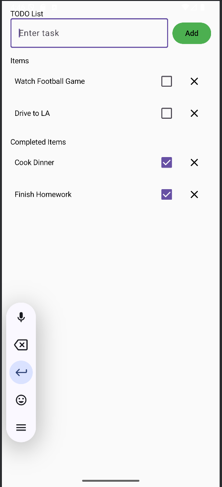
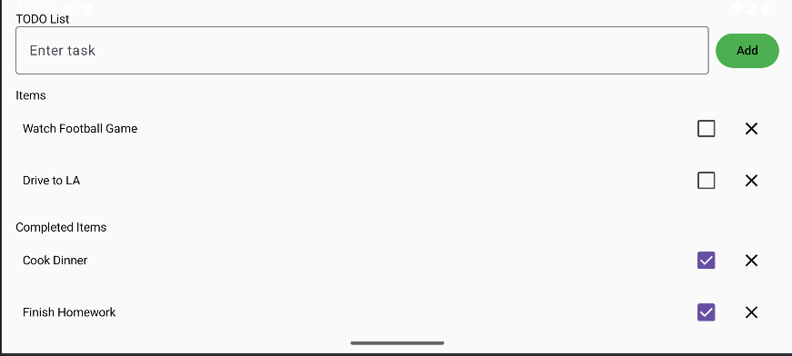

# ToDoList
This repo is for Project 1 CPSC 411a where we are creating a simple To Do List app

Here are the screenshots of the project:

CONCEPT USED:

Data Class: data class Todo(var text: String, var isdone: Boolean = false)
This is used for creating a data class that has the to-do item label and the completion state.

State Management:
the state is managed with mutableStateOf and rememberSaveable.
This allows the app to auto recomposes the UI when the list changes.
Tasks are preserved across the screen rotations using a custom listSave.
var listofTodoItems by rememberSaveable(stateSaver = todoListSaver) {
    mutableStateOf(emptyList())
}

State Hoisting:
UI elements like TaskList() and TaskRow() are stateless.
The parent is TodoApplication() which owns the actual state and passes the current list of taks and even callbacks such as OnToggle, on Remove.
This help the data flow be unidirectional and the cody is easy to maintain.

Compose UI Concepts.
Layouts such as Column, Row, and Spacer help organize the screen.
Input: OutlinedTextField, Button, Checkbox, IconButtion.
Theming: Material 3 components are used for styling
Empty State: The app displays "no items yet" when the list is empty. 

